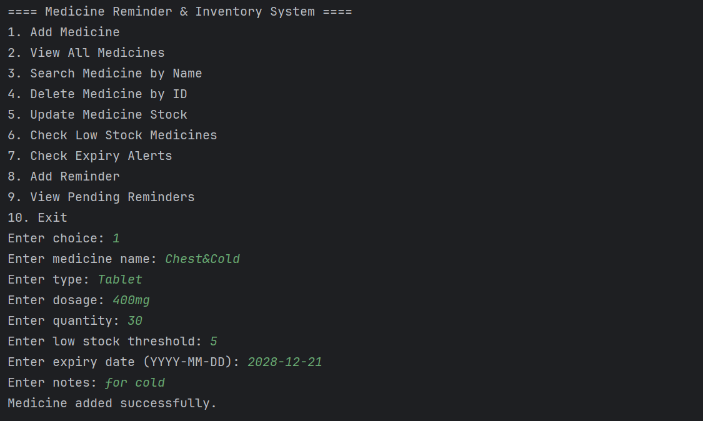
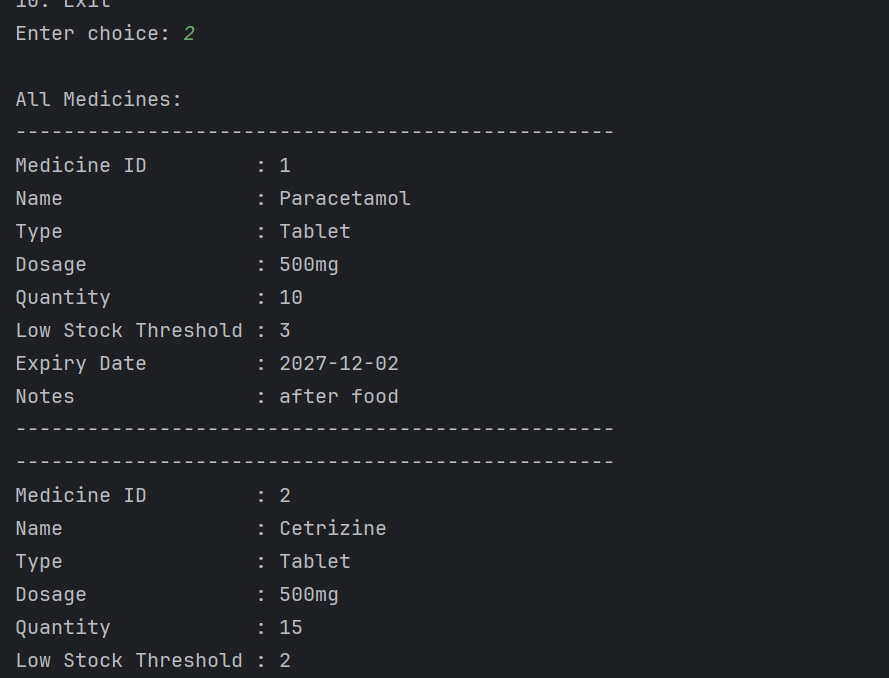
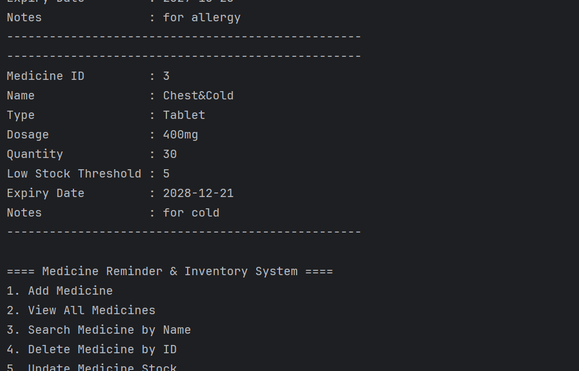
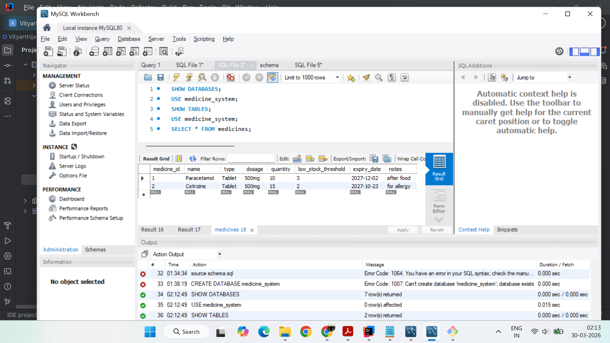
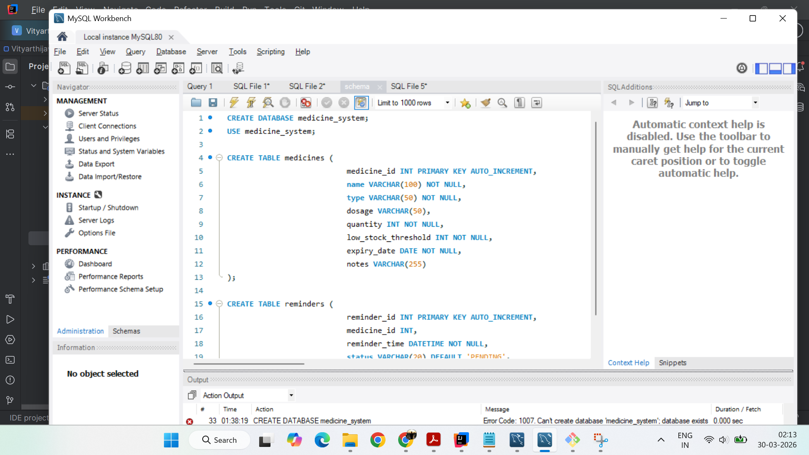
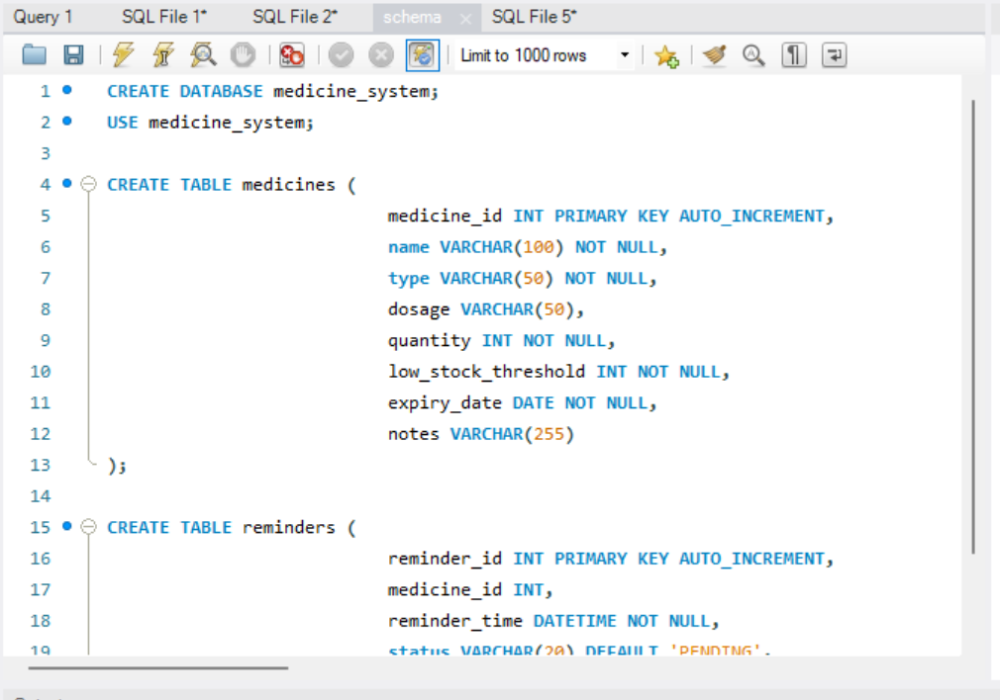

# Medicine Reminder & Inventory System

A Java-based console application that helps users manage medicine inventory, monitor stock availability, check expiry dates, and schedule reminders for medicines.

---

## 1. Project Overview

Managing medicines manually can be difficult, especially when multiple medicines are involved. People may forget to take medicines on time, may not notice when stock is low, or may accidentally keep expired medicines. This project provides a simple digital solution to store medicine information, track inventory, monitor expiry dates, and manage reminders in one place.

This project was developed as a **BYOP (Bring Your Own Project)** submission for the **Programming in Java** course.

---

## 2. Problem Statement

Many people face the following issues in daily life:

- forgetting to take medicines on time
- not tracking medicine stock properly
- failing to identify low-stock medicines
- overlooking expiry dates
- maintaining medicine records manually in notebooks or notes apps

The Medicine Reminder & Inventory System solves this problem by providing a structured Java-based inventory and reminder management system.


## 3. Features

- Add new medicine
- View all medicines
- Search medicine by name
- Delete medicine by ID
- Update medicine stock
- Check low-stock medicines
- Check expired medicines
- Check medicines expiring soon
- Add medicine reminders
- View pending reminders
- Mark reminders as completed

---

## 4. Technology Stack

- **Programming Language:** Java
- **Database:** MySQL
- **Database Connectivity:** JDBC
- **IDE:** IntelliJ IDEA
- **Version Control:** Git
- **Repository Hosting:** GitHub
- **Database Tool:** MySQL Workbench

---

## 5. Project Structure

```text
src/
 ├── dao/
 │    ├── MedicineDAO.java
 │    └── ReminderDAO.java
 ├── model/
 │    ├── Medicine.java
 │    └── Reminder.java
 ├── threads/
 │    └── ReminderMonitorThread.java
 ├── util/
 │    └── DBConnection.java
 └── MainApp.java

database/
 └── schema.sql

README.md
.gitignore

```
---

## 6. Important Files

### `src/MainApp.java`
Main entry point of the application.  
Handles menu display, user input, and method calls to DAO classes.

### `src/model/Medicine.java`
Model class representing medicine details such as name, type, dosage, quantity, expiry date, and notes.

### `src/model/Reminder.java`
Model class representing reminder details such as medicine ID, reminder time, and status.

### `src/dao/MedicineDAO.java`
Contains database operations related to medicines:
- add medicine
- view all medicines
- search medicine
- delete medicine
- update stock
- low stock check
- expiry checks

### `src/dao/ReminderDAO.java`
Contains database operations related to reminders:
- add reminder
- fetch pending reminders
- mark reminder as completed

### `src/util/DBConnection.java`
Provides JDBC connection to MySQL database.

### `database/schema.sql`
Contains SQL commands to create the database and required tables.

### `src/threads/ReminderMonitorThread.java`
Thread class structure prepared for future automatic reminder monitoring.

---

## 7. Database Setup

Make sure MySQL Server is installed and running.

### Run the schema file
Open **MySQL Workbench** and execute the SQL commands present in:

```text
database/schema.sql
```

This creates:
- `medicine_system` database
- `medicines` table
- `reminders` table

---

## 8. Configure Database Connection

Open the file:

```text
src/util/DBConnection.java
```

Update the following credentials according to your local MySQL setup:

```java
private static final String URL = "jdbc:mysql://localhost:3306/medicine_system";
private static final String USER = "root";
private static final String PASSWORD = "your_password";
```

---

## 9. How to Run the Project

### Step 1: Clone the repository
```bash
git clone https://github.com/your-username/Medicine-Reminder-Inventory-System.git
```

### Step 2: Open the project
Open the project in **IntelliJ IDEA** or any Java IDE.

### Step 3: Install required tools
Make sure you have:
- Java installed
- MySQL Server installed
- MySQL Workbench installed
- MySQL Connector/J added to the project libraries

### Step 4: Execute database schema
Run the SQL file in MySQL Workbench:
```text
database/schema.sql
```

### Step 5: Configure DB credentials
Edit `DBConnection.java` with your MySQL username and password.

### Step 6: Add MySQL Connector/J
Add the MySQL JDBC driver JAR to the project libraries in IntelliJ.

### Step 7: Run the application
Run:

```text
MainApp.java
```

---

## 10. Sample Menu

```text
==== Medicine Reminder & Inventory System ====
1. Add Medicine
2. View All Medicines
3. Search Medicine by Name
4. Delete Medicine by ID
5. Update Medicine Stock
6. Check Low Stock Medicines
7. Check Expiry Alerts
8. Add Reminder
9. View Pending Reminders
10. Exit
```

---

## 11. Reminder Input Format

When adding a reminder, enter date and time in the following format:

```text
YYYY-MM-DDTHH:MM
```

Example:

```text
2026-03-31T09:30
```

---

## 12. Key Java Concepts Used

This project applies several concepts from the Programming in Java syllabus:

### Java Basics
- variables
- data types
- input/output using `Scanner`
- conditional statements
- loops
- menu-driven flow control

### Object-Oriented Programming
- classes and objects
- constructors
- methods
- encapsulation using private fields and getters/setters

### Exception Handling
- try-catch blocks
- input validation
- handling SQL exceptions and parsing errors

### Collections Framework
- `ArrayList` used in DAO methods to store and return multiple records

### JDBC
- database connectivity using JDBC
- CRUD-style operations on MySQL database

### Multithreading
- reminder monitoring thread structure included for further expansion

### Packages and Code Organization
- code separated into `model`, `dao`, `util`, and `threads` packages for modularity

---

## 13. Testing

The following test scenarios were performed:

### Medicine Module
- add medicine with valid inputs
- view all inserted medicines
- search medicine by partial/full name
- update stock for existing medicine
- delete medicine by valid ID
- attempt delete with invalid ID

### Inventory Module
- check medicines with quantity less than or equal to threshold
- verify low-stock medicines are displayed correctly

### Expiry Module
- check already expired medicines
- check medicines expiring within a given number of days

### Reminder Module
- add reminder for an existing medicine
- view pending reminders
- mark reminder as completed
- verify completed reminders no longer appear in pending reminders

### Database Testing
- verify records are inserted into MySQL tables
- verify records update and delete correctly

---

## 14. Further Improvements

Possible future enhancements include:

- automatic reminder notifications using background thread
- GUI implementation using Swing or JavaFX
- multiple-user login system
- export reports to text or CSV files
- medicine consumption history
- dashboard summary for stock and reminders
- email or mobile notification support

---
## Some Screenshots of the Project

    
    
    
    
    
    
    

## 15. Final Note

This project is a practical application of Java programming concepts to solve a real-world healthcare management problem. It demonstrates the use of Java fundamentals, object-oriented design, exception handling, collections, JDBC database connectivity, and modular code organization in a meaningful and usable way.

---

## 16. Author

**Kushagra Tewari 24BAI10609**

---

## 17. Academic Use

This project was created for academic submission as part of the **Programming in Java** course.
```